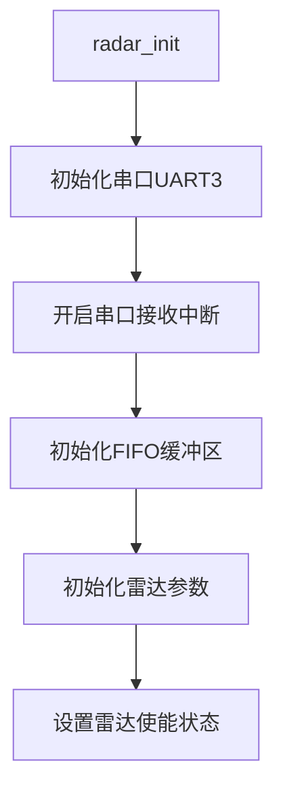
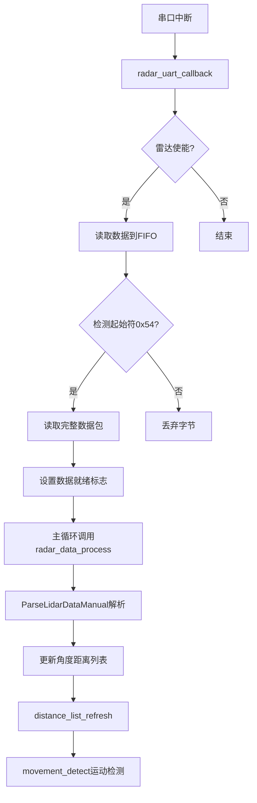
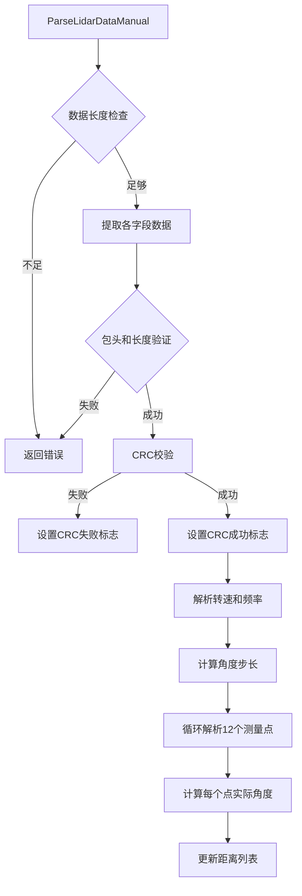

# LD06激光雷达数据处理模块文档

## 项目概述

这是一个用于处理LD19/LD06激光雷达数据的嵌入式C语言模块，实现了雷达数据的接收、解析、存储和相关算法处理。该模块基于逐飞TC264开源库开发，适用于嵌入式激光雷达应用场景。完整的TC264工程移步我的另一仓库。

## 文件结构

```
├── radar_cal.h          # 头文件 - 数据结构定义和函数声明
├── radar_cal.c          # 源文件 - 功能实现
└── isr_config.h         # 中断配置文件（依赖）
```

## 核心数据结构

### 1. 角度点测量数据 (`fraction_data`)
```c
typedef struct {
    float distance;        // 距离测量值（mm）
    uint8_t movement_flag; // 运动检测标志位
    uint16_t intensity;    // 信号强度值
} fraction_data;
```

### 2. 激光雷达参数 (`lidar_parameter`)
```c
typedef struct {
    uint16_t speed;                        // 雷达转速（度/秒）
    float frequency;                       // 扫描频率（Hz）
    fraction_data point[FRACTION_COUNT];   // 720个角度点的测量数据
    float current_angle;                   // 当前角度（度）
    uint16_t timestamp;                    // 时间戳（ms）
    uint8_t crc_condition;                 // CRC校验状态
} lidar_parameter;
```

## 主要常量定义

```c
#define FRACTION_COUNT 720     // 角度分辨率（0.5度/点）
#define RADAR_PACKET_SIZE 47   // 数据包大小
#define POINT_PER_PACK 12      // 每包测量点数
#define HEADER 0x54           // 数据包起始字节
```

## 函数流程图

### 系统初始化流程


### 数据接收解析流程


### 数据包解析详细流程


## 函数详细说明

### 1. 初始化函数
```c
void radar_init(void);
```
- 功能：初始化雷达系统
- 参数：无
- 说明：初始化串口、FIFO、雷达状态参数
- 注意：本函数基于tc264，其他单片机需自行修改

### 2. 串口回调函数
```c
void radar_uart_callback(void);
```
- 功能：串口中断回调，接收雷达数据
- 调用：在串口中断中自动调用
- 说明：负责数据接收和初步处理
- 注意：本函数基于tc264，其他单片机需自行修改

### 3. 数据处理函数
```c
void radar_data_process(void);
```
- 功能：主循环中调用，解析数据包
- 调用：在主程序循环中周期性调用

### 4. 数据包解析函数
```c
int ParseLidarDataManual(uint8_t *data, int len);
```
- 功能：手动解析雷达数据包
- 参数：数据指针和长度
- 返回：成功(0)或失败(-1)

### 5. 距离列表更新函数
```c
void distance_list_refresh(float degree, float distance, uint16_t intensity);
```
- 功能：更新指定角度的距离数据
- 参数：角度、距离、信号强度

### 6. 运动检测函数
```c
void movement_detect(int index, float distance);
```
- 功能：检测距离突变，判断运动
- 参数：角度索引、当前距离

### 7. CRC校验函数
```c
uint8_t CalCRC8(uint8_t *p, uint8_t len);
```
- 功能：计算CRC8校验值
- 参数：数据指针和长度

## 使用示例

### 基本使用流程

```c
#include "radar_cal.h"

int main(void)
{
    // 1. 系统初始化
    system_init();//示例，无法直接CV
    radar_init();
    
    while(1)
    {
        // 2. 主循环中处理雷达数据
        radar_data_process();
        
        // 3. 使用雷达数据
        if(lidar.point[0].distance < 1000) {
            // 处理近距离障碍物
            avoid_obstacle();
        }
        
        // 4. 检测运动
        for(int i = 0; i < FRACTION_COUNT; i++) {
            if(lidar.point[i].movement_flag) {
                handle_movement(i);
                lidar.point[i].movement_flag = 0; // 清除标志
            }
        }
        
        delay_ms(10);
    }
}

// 串口中断服务函数示例
void UART3_IRQHandler(void)//通用示例
{
    radar_uart_callback();  // 雷达数据接收
}
//TC264示例，提示：通讯速率较高，推荐在isr_config.h中，将uart0和3的中断回调改到1核
IFX_INTERRUPT(uart3_rx_isr, 0, UART3_RX_INT_PRIO)
{
    interrupt_global_enable(0);                     // 开启中断嵌套
    IfxAsclin_Asc_isrReceive(&uart3_handle);

    radar_uart_callback();
//    gps_uart_callback();


}
```

### 数据访问示例

```c
// 获取指定角度的距离数据
float get_distance_at_angle(float angle_deg)
{
    int index = (int)(angle_deg / 360.0f * FRACTION_COUNT);
    if(index >= 0 && index < FRACTION_COUNT) {
        return lidar.point[index].distance;
    }
    return -1; // 无效角度
}

// 检测前方障碍物
int check_front_obstacle(float threshold)
{
    // 前方角度范围：-30° 到 30°
    int start_index = (int)(330 / 360.0f * FRACTION_COUNT); // -30°
    int end_index = (int)(30 / 360.0f * FRACTION_COUNT);   // +30°
    
    for(int i = start_index; i != end_index; i = (i + 1) % FRACTION_COUNT) {
        if(lidar.point[i].distance < threshold) {
            return 1; // 检测到障碍物
        }
    }
    return 0;
}
```

## 重要说明

1. **硬件依赖**：基于TC264单片机，使用UART3接口
2. **数据格式**：LD19/LD06雷达，小端字节序
3. **角度范围**：0-360度，划分为720个点（0.5度分辨率）
4. **距离范围**：0-12000mm（12米）
5. **数据频率**：每个数据包包含12个测量点

## 移植注意事项

1. 移植到其他平台时需要重写FIFO相关代码
2. 串口配置需要根据实际硬件调整
3. 内存较小的平台可减少`FRACTION_COUNT`值
4. 中断处理函数需要根据具体MCU调整

## 许可证

本项目基于GPL v3.0许可证发布，使用了逐飞TC264开源库。
